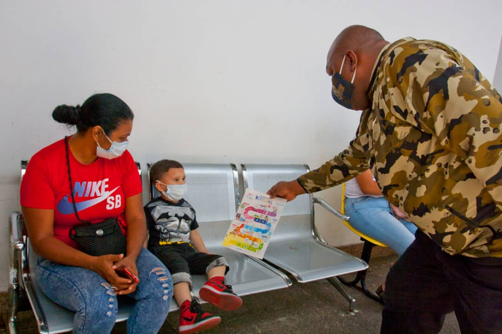

Este miércoles 21 de abril, el diputado Alexander Vargas y jefe político del Movimiento por la Paz y la Vida, realizó jornada de Embellecimiento y Desinfección, cumpliendo con la instrucción emanada por el presidente Nicolás Maduro Moros y la rectora de la La Gran Misión Venezuela Bella; Jacqueline Farias, rompiendo así con todas las cadenas de contagio y concientizando a toda la ciudadanía.

La Jornada 54 de la Fundación del Movimiento por la Paz y la Vida, Ente Adscrito al Despacho de la Presidencia y Seguimiento de la Gestión de Gobierno, se desarrolló en el Hospital JM de Los Ríos, ubicado en San Bernardino, del municipio Libertador; 'Seguimos cortando la cadena Covid-19 y limpiando espacios importantes con hipoclorito, también llevando tapabocas y llenando de amor a los niños y niñas de la patria', así lo dio a conocer Vargas.

Asimismo, informó que atenderá espacios deportivos del punto y circulo y llevará atención básica de actividad física a todos los niños del mencionado nosocomio, para continuar elevando la Paz y el Diálogo en todos los espacios... 'Mientras tenemos la disciplinas de cuidarnos de la pandemia, nosotros seguimos trabajando en la recuperación de espacios, y desplegando los equipos multidisciplinario de Actividad Física, para levantar el ánimo de los niños en condición de vulnerabilidad del JM de Los Rios', explicó.

Finalmente, ratificó el compromiso de seguir desinfectado, embelleciendo y recuperando los espacios que sean necesarios: 'Ahorita estamos enfocados en vencer el Covid-19, pedimos a toda la ciudadanía a respetar las medidas emanadas por nuestro presidente Nicolás Maduro Moros, que ha sido estratega, y sobre todo protector', concluyó el líder político y pacificador.

**Yaritza Galvis Ystúriz**
Fotos: **Enrique Hernández**