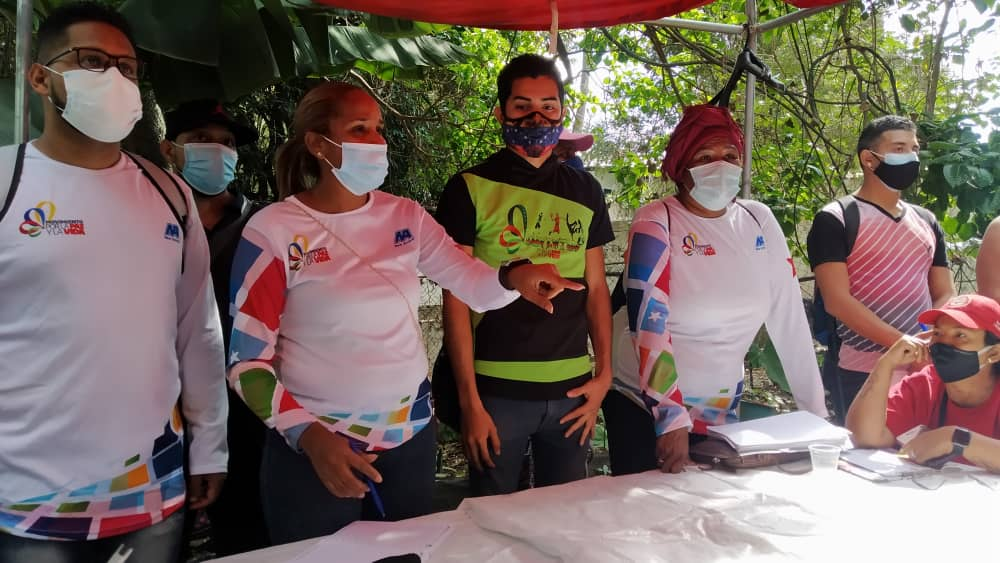

Cumpliendo el llamado del presidente Nicolás Maduro Moros y las instrucciones del jefe político del Movimiento por la Paz y la Vida; Alexander Mimou Vargas, que exhortó a todos los equipos de la FMPV, Ente adscrito al Despacho de la Presidencia y Seguimiento de la Gestión de Gobierno, para consolidar los 'Núcleos de Paz', con la intención de garantizar la cultura de paz y diálogo en cada sector vulnerable del territorio nacional.

La primera reunión se concretó en el sector La Pastora, parroquia La Pastora, del municipio Libertador, donde también inicia la recuperación de las '200 canchas'; proyecto enmarcado en 'El Plan Caracas Patriota, Bella y Segura'... 'La reunión se realizó con las fuerzas vivas, del eje 4 de La Pastora, donde se postularon los ciudadanos que llevarán la batuta en el primer Núcleo de Paz modelo', así lo explicó Lipson Ferrer, director de la Muchachada del Movimiento por la Paz y la Vida.

Asimismo, Beysimar Pérez, explicó el nivel de compromiso político que asumen las mujeres en cada territorio; 'Somos las madres, las jefas de calle, las que resolvemos los conflictos y medianos con la bandera de paz, por eso nosotras tenemos un gran compromiso con la patria, y lo vamos a fortalecer con los Núcleos de Paz', así lo dio a conocer la representante nacional del sector Mujer del MPV.

Finalmente, Keywer Andrade, Secretario de Juventud del Movimiento por la Paz y la Vida, explicó las tareas puntuales de los Núcleos de Paz; 'Tenemos varias tareas, entre ellas la de llevar la Paz a todos los barrios de Venezuela, a órganizar la Juventud y entregar todo el poder para organizar el deporte,  la cultura, recreación y actividad física. Entregar todos los espacios a la juventud organizada, tarea que realizaremos eje por eje, con mucha mística y disciplina', concluyó.

**Yaritza Galvis Ystúriz**
Fotos: **Enrique Hernández**
