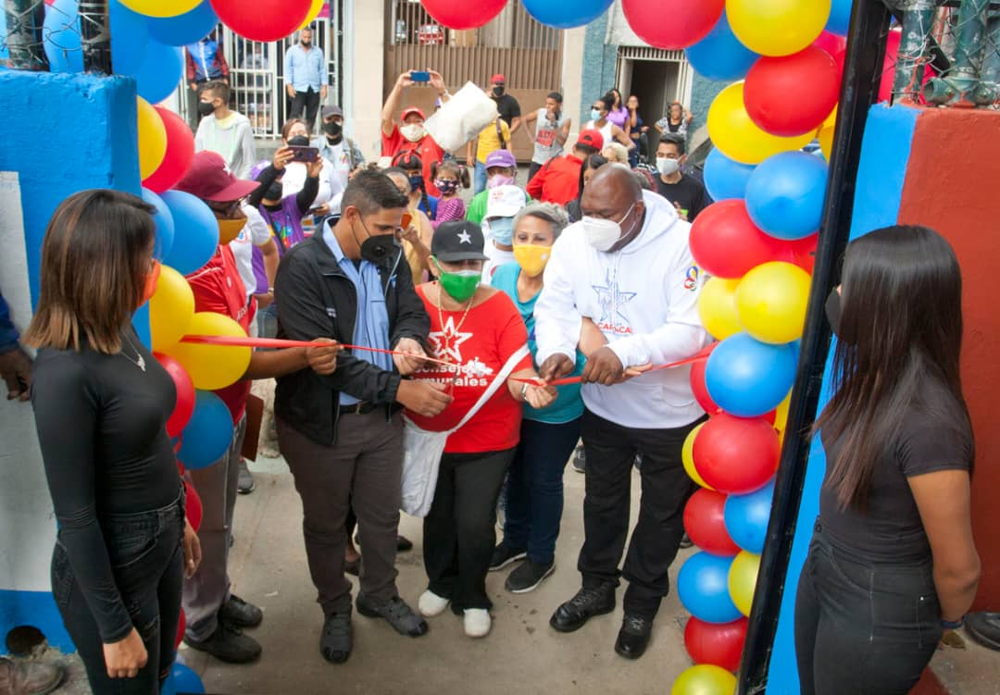

De acuerdo a la instrucción emanada por el presidente Nicolás Maduro Moros y la ministra A/J, Carmen Teresa Meléndez, de recuperar todos los espacios deportivos, a través del 'Plan Caracas Patriota, Bella y Segura', este viernes 23 de abril se llevó a cabo la primera inauguración de la cancha deportiva, ubicada en La Pastora, municipio Libertador, en conjunto con el Fondo Nacional Antidroga (FONA), del Ministerio del Interior Justicia y Paz, lo cual corresponde a la primera de 200 canchas que están prevista a recuperar en toda la ciudad capital.

El Diputado Alexander Vargas manifestó que a partir de esta semana se compromete en recuperar los espacios deportivos necesarios para lograr el objetivo de inclusión y masificación  deportiva y recreativa en toda Caracas; 'La meta es rehabilitar 200 canchas en la ciudad Capital, apoyar el talento deportivo de las zonas más vulnerables de la capital de Venezuela', así lo dio a conocer el parlamentario y jefe Político del Movimiento por la Paz y la Vida.

Asimismo, Harold Clemente, Director Nacional del Fondo Nacional Antidroga (FONA), eseguró que todas las parroquias de Caracas tendrán sus canchas recuperadas; 'La instrucción de la ministra Carmen Melendez es de entregarle a la juventud espacios dignos para que puedan hacer deporte, para que tengan motivos de crecer con valores culturales y recreativos', explicó Clemente. 

Finalmente, Vargas recordó que cada cancha deportiva tendrá un Núcleo de Paz organizado por líderes de cada sector que serán los responsables de mantener los espacios y activar el deporte en cada zona; 'Estamos trabajando con los líderes de cada parroquia para que resguarden todas las canchas que se vayan recuperando, asimismo estamos dando inducción de actividades físicas y recreativas para que en conjunto con la Juventud conviertan estos espacios en zonas de paz, diálogo y valores para el desarrollo de la juventud', concluyó Vargas.

**Yaritza Galvis Ystúriz**

Fotos: **Enrique Hernández**