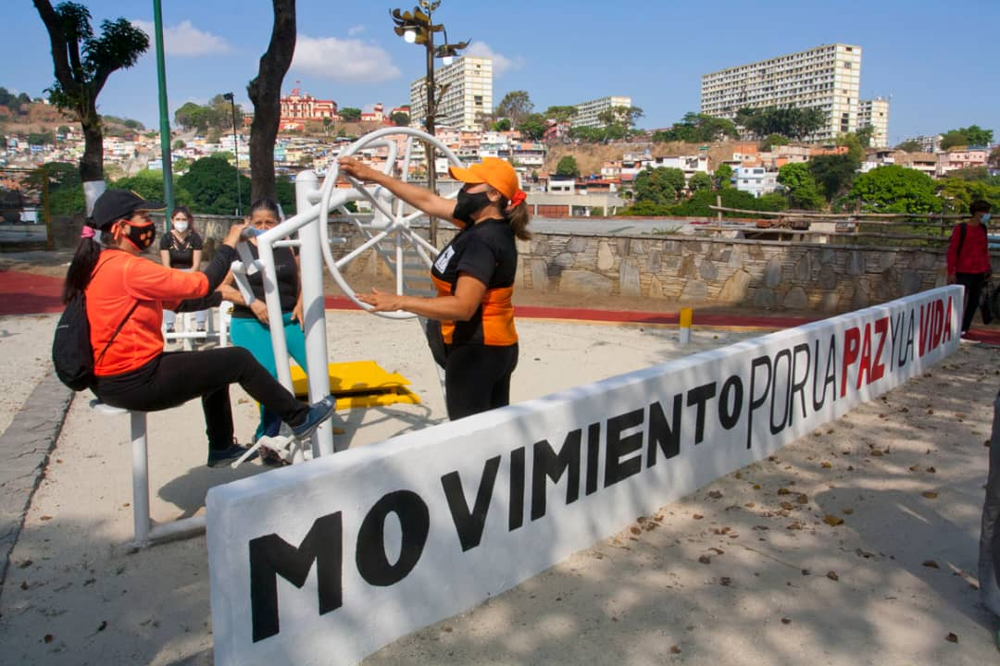

Este sábado 1 de mayo, la Fundación Movimiento Por la Paz y la Vida, encabezado por el Alto Comisionado Presidencial por la Paz y la Vida; Alexander Vargas Gutiérrez, llevó a cabo la inauguración de la Plaza de Arte Urbano, mejor conocida como 'Paguita', diagonal al Palacio de Miraflores, espacio recuperado para la práctica artístico, productiva, deportivo, urbano y, religioso, obras que consolidan la Paz y la Vida en la ciudad capital.

En dicha inauguración, también estuvo presente el Viceministro de Asuntos de Paz, del Despacho de la Presidencia y Seguimiento de la Gestión de Gobierno; Emilio Feriozzi y el Secretario Ejecutivo de la Comisión Presidencial por la Paz y la Vida; Robert Martínez. 

Asimismo, Vargas explicó que:  'No hay una obra multimillonaria, sólo compromiso, con una estructura organizada, con deporte nocturno y recreación para la Muchachada y la Juventud', así lo dio a conocer el Alto Comisionado Presidencial por la Paz y la Vida. 

No obstante, manifestó que el kiosko de la unidad socioproductiva tendrá instalado una venta de tizana y jugos naturales; "Para garantizar el seguimiento y control de este importante espacio recreativo, estamos dejando una unidad socioproductiva que velará por el cuido y buen funcionamiento de los espacios', dijo Vargas. 

También, anunció que se van a recuperar los espacios de la iglesia 'Paguita', obra que arrancará en los próximos días en conjunto con la Gran Misión Venezuela Bella, encabezada por Jaqueline Farias; 'Será la obra que terminará de marcar la importancia de la plaza de Arte Urbano, que en los próximos 60 días estará concluida para el disfrute de todos los cristianos que habitan en este punto y circulo', concretó. 

Juan Rodríguez, ingeniero que llevó a cabo la obra explicó que; 'Fue realizada con material de reciclaje, es una obra autosustentable. Ante la adversidad y guerra económica; sí se puede llevar a cabo obras emblemáticas, que contribuyen con la recreación de la Muchachada y Juventud', explicó el ingeniero.

**Yaritza Galvis Ystúriz**

Fotos: **Enrique Hernández**
