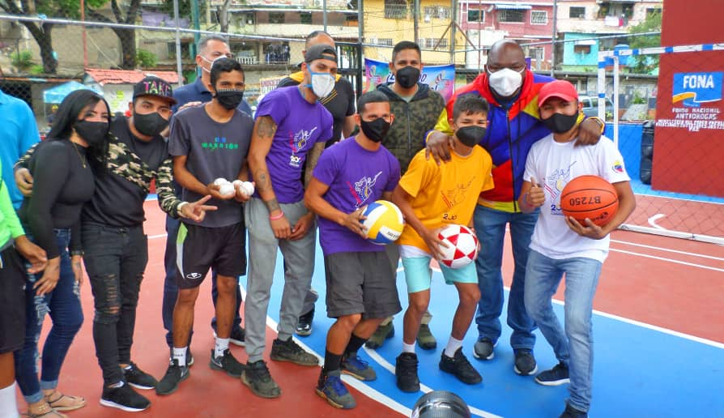

El Diputado y Alto Comisionado Presidencial del Movimiento por la Paz y la Vida, Alexander “Mimou” Vargas, acompañado del Secretario Ejecutivo de la Comisión Presidencial por la Paz y la Vida; Robert Martínez, el viceministro de Asuntos para la Paz del Despacho de la Presidencia y Seguimiento de la Gestión de Gobierno; Emilio Feriossi y el Director Ejecutivo del Fondo Nacional Antidrogas (Fona), Harol Clemente, reinauguraron tres canchas deportivas, dichas actividades estuvieron  enmarcadas en el Plan Caracas Patriota, Bella y Segura, que busca recuperar, embellecer, acondicionar espacios públicos y monumentos, ubicados en las 22 parroquias de la ciudad capital.

Bajo los lineamientos de la titular del Ministerio del Poder Popular para Relaciones Interiores, Justicia y Paz (Mpprijp), A/ J Carmen Meléndez, se rehabilitó la cancha de la parroquia El Recreo, avenida Andrés Bello, específicamente en el barrio Santa Rosa, donde los habitantes de la comunidad tendrán un espacio apropiado para el deporte, la cultura y la recreación.

Igualmente, en el sector El Fraile de Párate Bueno, en Antímano, se reinauguró una cancha deportiva para el disfrute de los habitantes de esta zona caraqueña.

También en esta triple jornada fue rehabilitada la cancha, ubicada en el kilómetro 11 de El Junquito, permitiendo que la comunidad tenga un espacio donde pueda compartir sanamente a través del deporte.

Durante estas actividades se entregaron implementos deportivos que incluyen balones de básquet, voleibol y fútbol para fomentar estilos de vida saludable.

El diputado Alexander Vargas, señaló que se estará activando el deporte de forma permanente en los espacios rehabilitados para el disfrute de los niños y jóvenes, llevando alegría y bienestar social al pueblo.

Recordemos que el Plan Caracas Patriota, Bella y Segura incluye la recuperación de 200 canchas deportivas en las 22 parroquias de la capital.

El Fona contribuye con el fortalecimiento de la lucha contra las drogas, mediante jornadas  sociales de atención en las comunidades, con la rehabilitación de canchas y entrega de material deportivo para crear espacios que fortalezcan los factores de prevención desde el deporte y la cultura.

**Jonathan Prieto**

Fotos: **Enrique Hernández**
