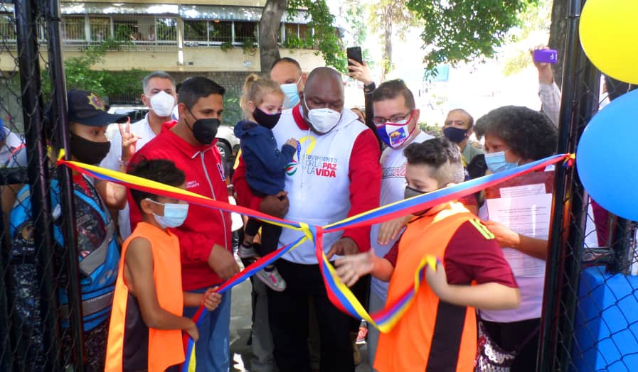

De acuerdo a los lineamientos emanados por el presidente Nicolás Maduro Moros, el Plan Caracas Patriota, Bella y Segura, continúa avanzando en las 22 parroquias de Caracas; inaugurando 16 canchas deportivas, 30 recuperadas y 40 en construcción, este plan está dirigido por la ministra de Interior, Justicia y Paz, A/J Carmen Teresa Meléndez y el ministro del Despacho de la Presidencia y Seguimiento de la Gestión de Gobierno, Jorge Eliecer Márquez Monsalve, y coordinado por el Alto Comisionado Presidencial Por la Paz y la Vida, Alexander Vargas Gutiérrez, el cual tiene como meta la recuperación de 200 canchas deportivas. 

En menos de 50 días, el Alto Comisionado Presidencial Por la Paz y la Vida, a través de la FMPV, se propuso la meta de recuperar 200 canchas en las 22 parroquias de Caracas: 'Tenemos el equipo multidisplcinario que está preparado para levantar las 200 canchas de las zonas más vulnerables de Caracas, con el objetivo de vencer el ocio, de recuperar los espacios que requiere la juventud para poder sembrar los valores que nos reclama la patria', así lo dio a conocer Vargas. 

Los despliegues de abordaje y supervisión han estado encabezados por el Secretario Ejecutivo de la Comisión Presidencial por la Paz y la Vida; Robert Martínez, el Viceministro de Asuntos para la Paz del Despacho de la Presidencia, Emilio Feriozzi, y el Director del Fondo Nacional Antidroga (FONA), Harold Clemente,los cuales se han encargado en conjunto con la comunidad de trabajar articulados de la mano de las cuadrillas, jóvenes y la estructura política territorial de cada parroquia de Caracas. 

La alegría, el deporte, cultura y recreación son los cuatro complementos que reinan al momento de abordar una cancha; 'Es importante resaltar el trabajo protágonico de la estructura orgánizada del sector Mujer y Juventud, que son las que en conjunto con la Muchachada del Movimiento por la Paz y la Vida se han encargado del despliegue y desarrollo de los Nucleos de Paz', explicó Vargas. 

Finalmente, manifestó con contundencia el compromiso de culminar el objetivo de la inauguración de 200 canchas deportivas en los próximos 50 días; 'Tenemos un compromiso con los barrios de Caracas, sobre todo con el Junquito, La Pastora, y Catia, lo cual estamos cumpliendo de manera rápida, yo quiero agradecer a todas las comunidades y estructuras políticas comprometidas con el presidente Nicolás Maduro Moros, nosotros seguiremos garantizando la Paz en todos los niveles', concretó el Alto Comisionado.

**C.Jeovanna R.**

Fotos: **Enrique Hernández**
