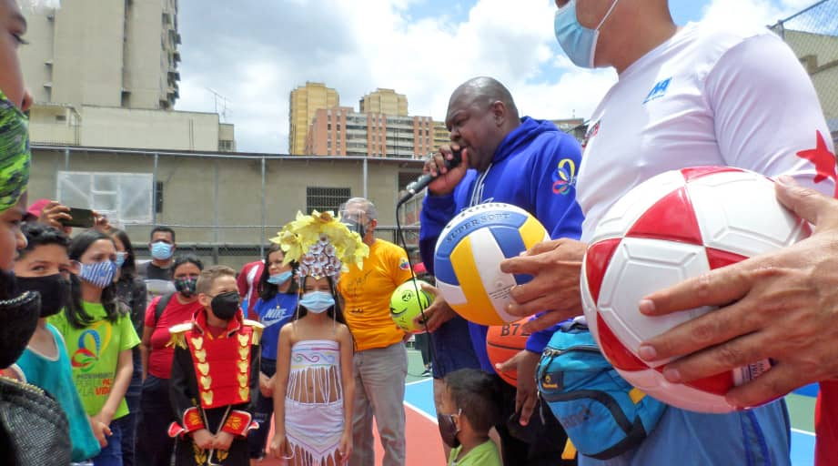

Este jueves 13 de mayo, el Alto Comisionado Presidencial Por la Paz y la Vida, Alexander Vargas Gutiérrez, reinauguró dos canchas deportivas en la ciudad capital, dichas actividades están enmarcada en el Plan Caracas Patriota, Bella y Segura, encabezadas por el Ministro del Despacho de la Presidencia y Seguimiento de la Gestión de Gobierno, Jorge Márquez Monsalve, y la Ministra de Interior, Justicia y Paz, Carmen Teresa Meléndez, está vez las parroquias beneficiadas fueron; Santa Teresa y el sector Andrés Bello de Caracas, municipio Libertador.

Asimismo, la pacificación sigue siendo la punta de lanza en el despliegue de cada rehabilitación de cancha deportiva, estos espacios impulsan el deporte, cultura y recreación para la juventud, dicha actividad estuvo acompañada por el Director de la Fondo Nacional Antidroga, Harold Clemente, el Secretario Ejecutivo de la Comisión Presidencial Por la Paz y la Vida, Robert Martínez y el Viceministro de Asuntos para la Paz Emilio Feriozzi. 

Fueron 205 cuadrilleros, 300 voluntarios, los que se desplegaron durante 5 días, para poder rehabilitar cada cancha deportiva, asimismo un aproximado de 41.900 familias beneficiadas, y 17 mil jóvenes impactados, así lo dio a conocer el Alto Comisionado Presidencial Por la Paz y la Vida, Alexander Vargas Gutiérrez, que lleva 26 canchas abordadas, siendo la meta: 200 canchas, con su Núcleos de Paz en cada punto y circulo de las 22 parroquias de Caracas. 

Finalmente, manifestó que este fin de semana llegarán casi a 40 canchas entregadas, para el disfrute de la Juventud y Muchachada; 'Estamos entregando espacios para el realce de valores, y reimpulso de la recreación y actividad física de las comunidades más vulnerables de Caracas', explicó Vargas.

**C. Jeovanna R.**

Fotos: **Enrique Hernández**

