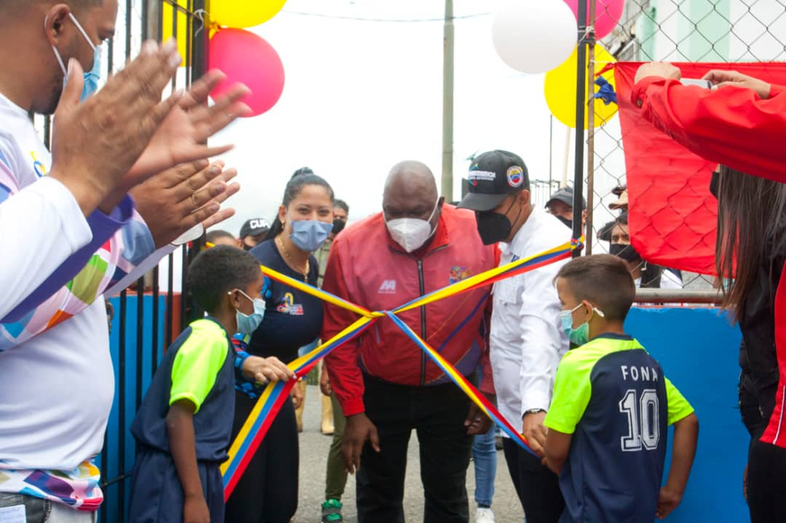

El Alto Comisionado Presidencial Por la Paz y la Vida, Alexander Vargas Gutiérrez, inauguró 6 canchas deportivas este jueves 20-M en los sectores; La Pedrera, El Limón, 23 de Enero, El Recreo, Antimano y Caricuao acompañado de Harold Clemente, Director Nacional del Fondo Nacional Antidroga (FONA), asimismo del Secretario Ejecutivo de Movimientos por la Paz y la Vida, Robert Martínez, el Viceministro de Asuntos de Paz; Emilio Feriozzi y la Vicepresidenta de la Fundación Movimiento Por la Paz y la Vida; Naryelin Hernández.

Asimismo, Vargas manifestó que se han atendido 48 Canchas de las cuales se encuentran 28 culminadas
y las 13 restantes que se terminarán esta semana en curso. Además, se han desplegado 418 Cuadrilleros del Movimiento por la Paz y la Vida y más de 406 voluntarios y voluntarias de las 22 parroquias de Caracas y se han impactado 65.997 Familias, con la intensión de sembrar los valores para el desarrollo de la Juventud.

También, con el propósito de fomentar una cultura deportiva y recreativa en las 22 parroquias Caraqueñas se inauguran canchas y espacio de paz; 'Gracias a las manos del pueblo, que con dedicación, trabajó varios días en el embellecimiento de la cancha deportiva, además al presidente Nicolás Maduro Moros, al Ministro Jorge Márquez y a la Ministra A/J, Carmen Teresa Meléndez, que gracias a su valiosa disposición política se crean espacios que impactan en lo social y trascienden en cada familia que hoy ve una alternativa para los niños, niñas y jóvenes del barrio', así lo dio a conocer Nahoret Pérez, jefa del territorio.

Finalmente, es importante decir que con estas área deportivas reinauguradas, el gobierno nacional honra compromisos adquiridos con las comunidades, asumidos durante la campaña electoral que dió la victoria a los Diputados de la revolución bolivariana, así lo dio a conocer el Alto Comisionado Presidencial Por la Paz y la Vida, Alexander Vargas Gutiérrez.

**Jehovanna Ramones**

Fotos: **Enrique Hernández**
