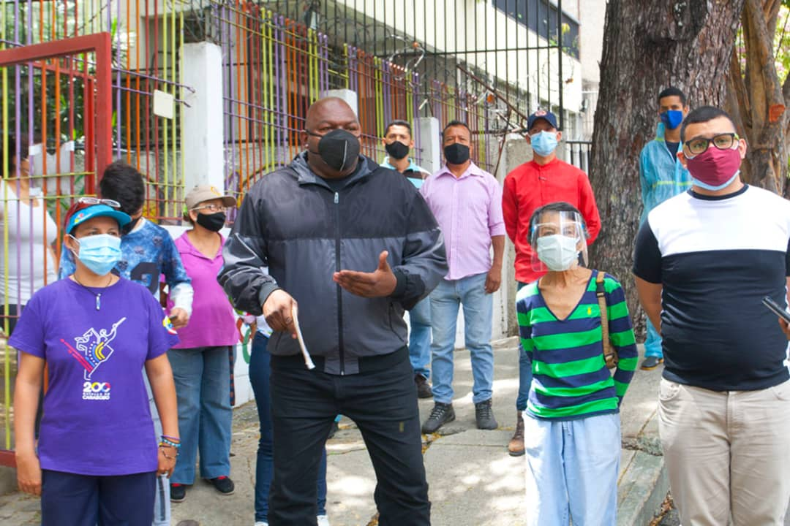

Enmarcado en la semana del Adulto Mayor, el Alto Comisionado Presidencial Por la Paz y la Vida, Alexander Vargas Gutiérrez, continúa trabajando en conjunto con la Gran Misión Venezuela Bella, encabezada por el presidente Nicolás Maduro Moros, y la rectora Jacqueline Farias, con la intención de atender todos sectores para quebrantar la cadena de contagio del covid-19.

La Fundación Movimiento por la Paz y La Vida, encabezada por el Ministro del Despacho de la Presidencia y Seguimiento de la Gestión de Gobierno; Jorge Eliecer Márquez Monsalve, arribó hoy a la jornada 59 de Embellecimiento y Desinfección, pues dicha institución ha sido constante en la tarea de embellecer y desinfectar a más de 1. 657. 395 espacios, la cual ha abrigado a las 22 parroquias de Caracas y el territorio nacional. 

Alexander Vargas, explicó que está semana se celebra la del Adulto Mayor, por eso se abocó a Desinfectar el Geriátrico Virgen del Pilar, ubicado en Bello Monte, parroquia El Recreo de Caracas, y los alrededores del mismo, 'En conjunto con Protección Civil hemos realizado limpieza profunda del Geriátrico de Bello Monte, donde hacen vida más de 50 abuelos y abuelas del punto y círculo, asimismo fueron abordados los alrededores con las comunas y consejos comunales, compuestas por 1200 familias', así lo dio a conocer el Alto Comisionado. 

Asimismo, Luis Caballeros, director del Liceo Bolivariano Julio Bustamante, que considera el tema de embellecer espacios, como un proyecto que contribuye con sentimiento, el arraigo y el rescate de valores, 'Nosotros como maestros de la patria debemos impulsar estas iniciativas, porque elevan el sentido de pertenencia, lo cual es un reto para nosotros como maestros preocupados por los valores de los estudiantes y del buen funcionamiento de nuestro espacios, que son enmarcados fundamentalmente en la educación y el sentido de pertenencia que uno siembre en la juventud', explicó el maestro.

Finalmente, Jonsy Díaz, representante del ámbito territorial del Consejo Comunal 'Amaranto', manifestó que la Fundación Movimiento por la Paz y la Vida lleva más de un mes dentro del punto y círculo de la parroquia El Recreo, 'Estamos preparando todos los espacios para los 200 años Bicentenario, en conjunto con las diferentes instrucciones del gobierno, especialmente con la FMPV, donde ya hemos inaugurado canchas deportivas, embelleciendo y desinfectado espacios, también creando Núcleos de Paz, para el fortalecimiento de nuestra Juventud, el semillero de la patria', concluyó la líder social.

**Jehovanna Ramones**

Fotos: **Enrique Hernández**
