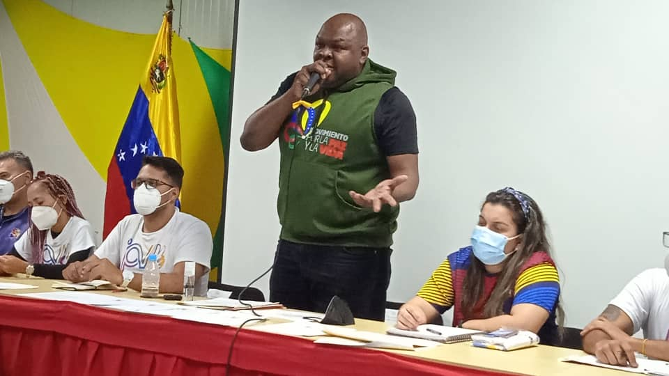

Este miércoles 26 de mayo, el Alto Comisionado Presidencial Por la Paz y La Vida, Alexander Vargas Gutiérrez, llevó a cabo la Juramentación de la Juventud del Movimiento por la Paz y La Vida y elevó propuestas de importancia para la Gran Misión Chamba Juvenil, basada en el acompañamiento que brindará La Fundación Movimiento por la Paz y La Vida, Ente Adscrito al Despacho de la Presidencia, el acto también estuvo acompañado de la viceministra de la Juventud; Jessica Bello.

Alexander Vargas, dio a conocer que pronto tendrá una gira nacional con la Juventud del Movimiento por la Paz y La Vida, para acompañar y brindar apoyo a los jóvenes que lo requieran; 'La Nueva Asamblea Nacional nos permitirá a través de las nuevas reformas y propuestas de ley poder avanzar en desarrollo de los planes de inclusión de la Juventud en pleno', explicó. 

Igualmente, la Viceministra de la Juventud, Jessica Bello, enfatizó que el objetivo debe ser la Juventud del barrio, como herramienta conductora de paz; 'La experiencia del Movimiento por la Paz y La Vida debe trascender, porque nos ha servido de mucho, como herramienta conductora de Paz, por eso estamos trabajando en la propuesta de poder unir la experiencia de la FMPV y las nuevas propuesta de Ley de la Gran Misión Chamba Juvenil', dijo. 

Asimismo, Keywer Andradre, Director Nacional de la Juventud del Movimiento por la Paz y La Vida, manifestó la importancia del llamado del presidente Nicolás Maduro en llevar la Paz, el Deporte y la Recreación en todo el territorio nacional; 'Porque la patria la construye la juventud, ya somos más de 1000 jóvenes que integramos la FMPV en todo el territorio nacional, por eso debemos seguir avanzando, construyendo la patria que Bolívar nos dio', concretó el líder juvenil.

**Jehovanna Ramones**

Fotos: **Enrique Hernández**
