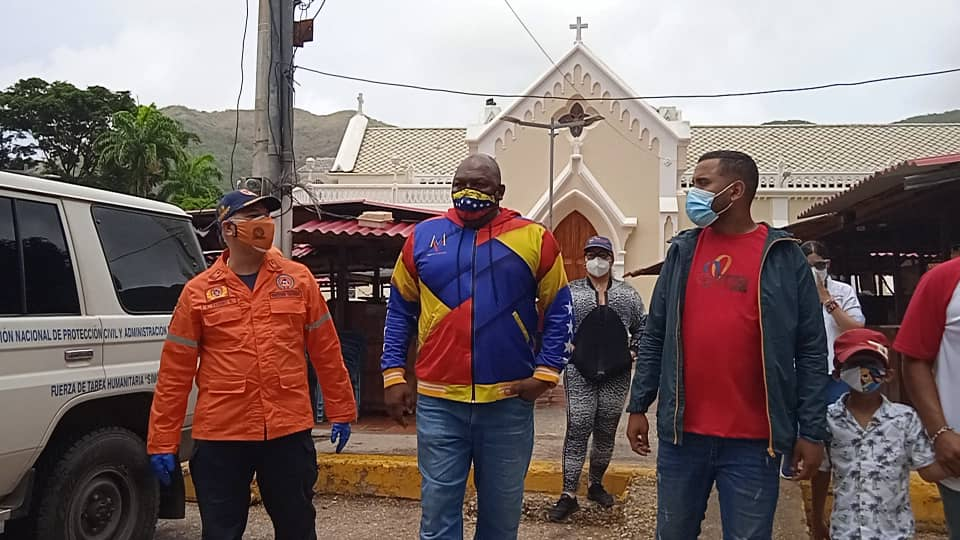

Este miércoles 16 de junio el Alto Comisionado Presidencial Por la Paz y La Vida, Alexander Vargas Gutiérrez, arribó al estado Nueva Esparta, específicamente al sector Pampatar, municipio Maneriro, para embellecer y desinfectar los espacios de la Iglesia  Nuestra Señora del Valle, actividad enmarcada en las Jornadas de la Gran Misión Venezuela Bella, la cuál es rectorizada por Jacqueline Farías con el objetivo de cortar la cadena de contagio del covid-19 y ademas embellecer los lugares más emblemáticos del territorio nacional.

Vargas, anunció que en Pampatar la Fundación del Movimiento por la Paz y la Vida, en conjunto con el Despacho de la Presidencia y Seguimiento de la Gestión de Gobierno, encabezado por el ministro G/D Jorge Márquez, llevará a cabo la conformación del Núcleo de Paz más amplio del país; 'Hoy nos encontramos embelleciendo todos los espacios adyacentes a la Iglesia Virgen del Valle, también estamos dando los primeros pasos a la conformación del Núcleo de Paz y Vida más amplio de Venezuela, el cual estará conformado por Corazón Urbano, y también  tendrá lugar la  rehabilitación de canchas deportivas, con la intención de llevar a toda la isla de Margarita, cultura, deporte y recreación', así lo dio a conocer Vargas.

Asimismo, los Nucleos de Paz, estarán distribuidos en 10 parroquias de la Isla de Margarita... 'Es el momento de encontrarnos con toda la estructura política de todos los estados del país, para continuar embelleciendo, y activando espacios deportivos para Paz y la Vida de todos los niños y niñas, convertir a esta zona en una potencia deportiva y turística del estado Nueva Esparta', expresó. 

Finalmente, dijo que en los próximos días dará inicio a una gira nacional, con toda la Fundación Movimiento por la Paz y La Vida, enmarcado en la apertura del Plan Venezuela Bella, Patriota y Segura... 'la semana que viene celebraremos el Bicentenario, y luego la entrada triunfal de Bolívar a Caracas, y finalmente cerraremos el año con el despliegue del Plan Venezuela, Bella, Patriota y Segura', concluyó.

**Jehovanna Ramones**

